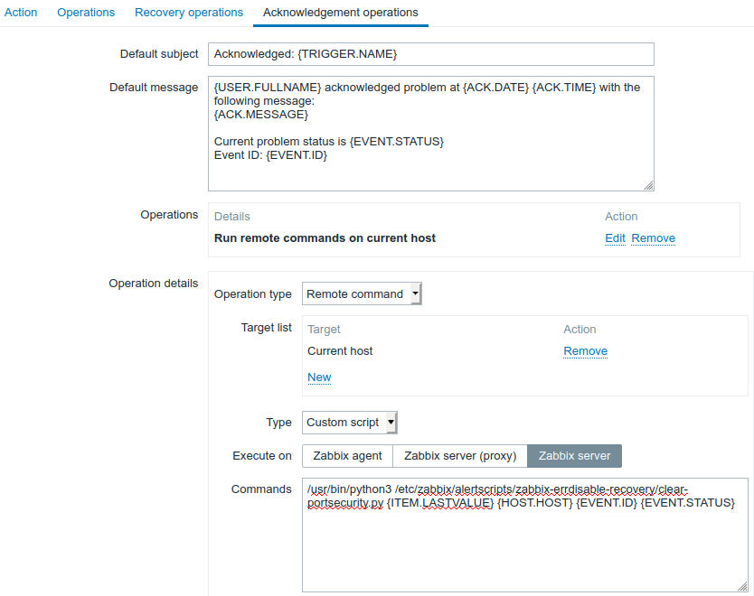

Скрипт разблокировки заблокированных механизмом **PortSecurity** портов на коммутаторах **Cisco** средствами _Zabbix_  
Для чего он нужен написано в статье по [ссылке](https://habr.com/en/post/491774/)

## Установка скрипта

1. склонировать файлы из репозитория *git pull/clone ...*
* доставить необходимые пакеты *pip install -r requirements.txt*
* создать файл *defaults/creds.yml* с таким содержимым

    ```yml
    user: cisco
    pass: cisco
    zabbix_url: https://zabbix.acmeloc
    zabbix_user: api
    zabbix_passwd: api
    ```
* создать файл *vault/vault_password* с паролем
* зашифровать *defaults/creds.yml* паролем из *vault/vault_password*:     
    > user@host:~$ ansible-vault encrypt --vault-password-file vault/vault_password defaults/creds.yml
* скопировать все файлы в директорию */etc/zabbix/alertscripts/zabbix-errdisable-recovery/*  
    и затем модифицировать права на файлы выполнив команду:
    > user@host:~$ chown -R zabbix /etc/zabbix/alertscripts/zabbix-errdisable-recovery/
* в веб-морде *Zabbix* создать **Action** и настроить действия в вкладке **Acknowledgement operations** следующим ообразом:

    > Строка запуска:   
        /usr/bin/python3 /etc/zabbix/alertscripts/zabbix-errdisable-recovery/clear-portsecurity.py {ITEM.LASTVALUE} {HOST.HOST} {EVENT.ID} {EVENT.STATUS}
